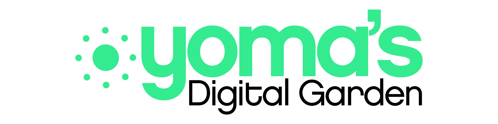

### Hi there 👋

I'm Ogheneyoma Okobiah, a Computer Engineering student committed to understanding the critical science of computer software and its engineering, understanding the concepts of Cloud Computing and Computer Hardware. Good knowledge in Python programming language. A community contributor focused on building local and global communities in Africa.

---
#### Skills and Interests:
- Programming Language(s): Python, C++(Beginner)
- OS: Linux, MacOS
- Web: Flask
- Cloud: HCP, AWS
- Project Management: Jira
- Others: Agile
- Language(s): English
- Interests: Data Science, Artificial Intelligence, Robotics
- Certifications: HCIA-Cloud Services, HCIA-Cloud Computing

---
#### Activities:
- Cloud Engineering intern at [Analog](https://analogteams.com)
- Partnerships and Finance Lead at [Open Source Community Africa (OSCA)](https://oscafrica.org)
---

#### Online presence/contacts:
- Blog: [My blog](www.yomaokobiah.com)
- Twitter: [My handle](https://twitter.com/yomdroid)
- LinkedIn: [My profile](https://www.linkedin.com/in/ogheneyoma-okobiah/)
- Email: yomdroid at gmail.com

<!--
**Yomdroid/Yomdroid** is a ✨ _special_ ✨ repository because its `README.md` (this file) appears on your GitHub profile.

Here are some ideas to get you started:

- 🔭 I’m currently working on ...
- 🌱 I’m currently learning ...
- 👯 I’m looking to collaborate on ...
- 🤔 I’m looking for help with ...
- 💬 Ask me about ...
- 📫 How to reach me: ...
- 😄 Pronouns: ...
- ⚡ Fun fact: ...
-->
